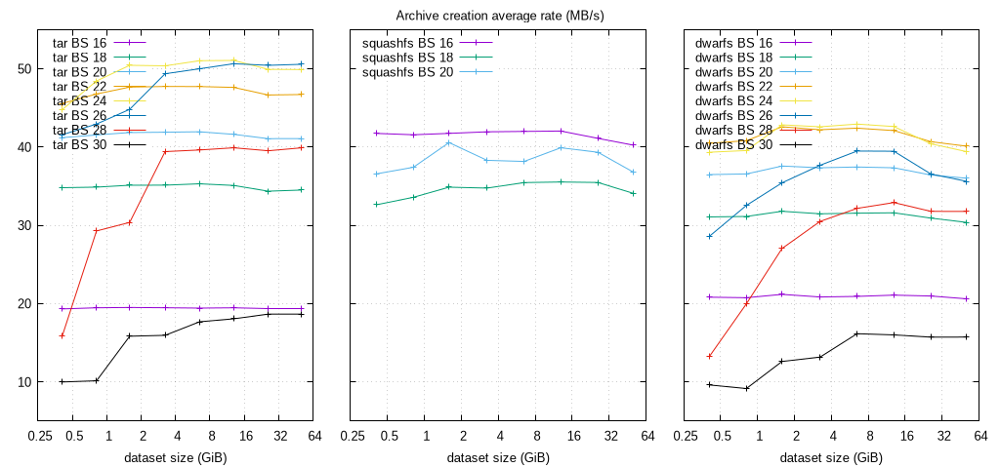
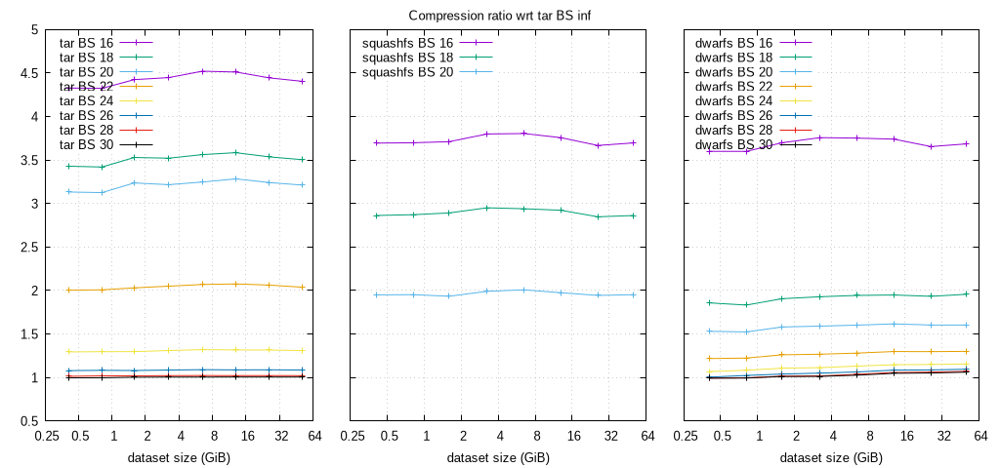
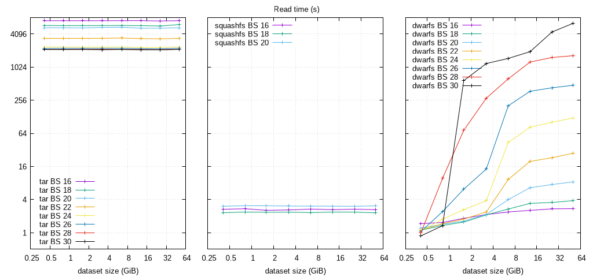

# DwarFS Scalability

A benchmark comparing Tar, SquashFS and DwarFS archives with a lot of files,
and highlights how DwarFS can become extremely slow in some conditions for
reading the content.

## Table of contents

- [Context](#context)
- [Benchmark setup](#benchmark-setup)
  - [Data description](#data-description)
  - [Commands description](#commands-description)
  - [Software description](#software-description)
  - [Host description](#host-description)
- [Analysis](#analysis)
  - [Creation time](#creation-time)
  - [Compression ratio](#compression-ratio)
  - [Reading time](#reading-time)
- [Conclusion](#conclusion)

## Context

I need to store logs generated every day, that are a bit large (around 400MB per day, i.e. almost 150GB per year),
and are made of a rather high number of files (around 8k per day, i.e. almost 3M per year).

As a consequence compressing files individually is not the most efficient solution,
both for compression ratio and for dealing with large amount of files during transfers.
My objective was to create monthly archives, that seemed optimal for manipulating the archives
to exploit the data (not too many archives to get useful time range, not too large archives).

I could have simply made a compressed archive: it works, and compression ratio is almost 1%.
But it means that it has to be uncompressed in order to be used.

So I tested creating a SquashFS archive instead: it works too, but I was disappointed by the
compression ratio, with created archives twice bigger.

Then I stumbled upon DwarFS, that gave optimal compression ratio and access speed when testing on
limited size archives. So I compressed everything using a larger block size and larger archives,
but when I tried reading them it was extremely slow. I noticed that it was due to
larger block size, but also to the size of the archive
(i.e. reading the same data is slower in a large archive than in a small archive).

I could understand that larger block sizes can cause lower read speed, as accessing a file requires
to uncompress a whole block, even though in this case I was not accessing data randomly.
But I had more difficulties understanding why increasing the archive size would decrease the
read speed, except maybe if block size is too large with regards to the archive size and read
speed is artificially higher with small archives.

In order to have a better view of the behavior and compare it with Tar and SquashFS archives,
I decided to test all block size and archive size combinations.

Note that this analysis only focuses on the particular type of data that I have,
with a specific use case, and cannot be generalized. However it still highlights the behavior of
DwarFS in this particular case.

## Benchmark setup

### Data description

The log folder for each day contains on average 7480 files (min 4500, max 12000)
and 407MB (min 305MB, max 493MB) of uncompressed data, that consist in `xml` and `csv` files.
They are highly compressible (can be compressed at best at 1% of their original size).

The reading test always reads the first day of the archive, which is the same in all archives.
It contains 437MB of uncompressed data, and 8200 files. It is available for
[download](http://crteknologies.fr/download/dwarfs/2022-12-01.tar.xz) for reference.

### Commands description

Archive creation (cf `scripts/compress.sh`):
```
$ mkdwarfs -l9 -S<log-block-size> --log-level warn --no-progress -i . -o <archive>
$ mksquashfs . <archive> -comp xz -b <block-size>
$ tar -I "xz -9 --block-size=<block-size> -T0" -cf <archive> .
```

Mount (cf `scripts/read.sh`):
```
$ dwarfs <dwarfs-archive> mount
$ mount -o loop <squashfs-archive> mount
$ archivemount  <tar-archive> mount
```

Read (cf `scripts/read-grep.sh`):
```
$ grep -R 'NON-EXISTING-STRING' *
```

### Software description

```
$ mkdwarfs --version

dwarfs (v0.9.7 [2024-04-10], fuse version 35)
built for x86_64, Linux-5.15.0-101-generic, Clang 18.1.0

using: FLAC++-1.4.3, boost-1.83.0, brotlidec-1.1.0, brotlienc-1.1.0,
       crypto-3.0.13, fmt-10.2.1, jemalloc-5.3.0, lz4-1.9.4, lzma-5.4.5,
       xxhash-0.8.2, zstd-1.5.5

$ mksquashfs -version
mksquashfs version 4.6.1 (2023/03/25)

$ tar --version
tar (GNU tar) 1.35

$ xz --version
xz (XZ Utils) 5.4.5
liblzma 5.4.5
```

### Host description

```
$ uname -a
Linux evolution 6.1.46-gentoo #1 SMP PREEMPT_DYNAMIC Sun Sep 10 02:52:53 CEST 2023 x86_64 Intel(R) Core(TM) i7-7820HQ CPU @ 2.90GHz GenuineIntel GNU/Linux

$ free -h
Mem:            31Gi

$ cat /cpu/procinfo
model name      : Intel(R) Core(TM) i7-7820HQ CPU @ 2.90GHz
cpu MHz         : 2900.000
cache size      : 8192 KB
siblings        : 8
cpu cores       : 4
```

## Analysis

I created and tested archives with the combinations of:
  * compression with different block sizes, from $2^{16}$ (64kB) to $2^{30}$ (1GB).
    Note however that SquashFS does not support block size over 1MB (20).
  * different, amount of data, from 1 day (~400MB and 8k files) to 128 days (~50GB and 1M files).

All archives are compressed with xz level 9.


### Creation time

Let's analyze first the time needed to create the archives, with multithreading enabled.
Tar with infinite block size is also provided in the first columns,
but note that it is single-threaded thus cannot really be used as a reference.

| days | size | files | tar_size | . | 16 | 18 | 20 | 22 | 24 | 26 | 28 | 30 |
| ---- | ---- | ----- | -------- | - | -- | -- | -- | -- | -- | -- | -- | -- |
| **Tar** |
| 1 | 416.94M | 8311 | 4.08M | . | 21.58 | 11.98 | 10.12 | 9.15 | 9.31 | 10.03 | 26.27 | 41.74 |
| 2 | 832.06M | 16683 | 8.16M | . | 42.75 | 23.86 | 20.03 | 17.79 | 17.18 | 19.38 | 28.42 | 82.08 |
| 4 | 1.59G | 28122 | 15.26M | . | 83.29 | 46.26 | 38.82 | 34.09 | 32.21 | 36.25 | 53.49 | 102.60 |
| 8 | 3.25G | 63744 | 31.44M | . | 170.47 | 94.48 | 79.23 | 69.53 | 65.89 | 67.24 | 84.20 | 208.12 |
| 16 | 6.49G | 133465 | 62.48M | . | 342.08 | 188.22 | 158.40 | 139.23 | 130.22 | 132.90 | 167.70 | 375.91 |
| 32 | 12.94G | 241317 | 123.55M | . | 680.76 | 377.57 | 318.36 | 278.26 | 259.49 | 261.64 | 332.05 | 733.76 |
| 64 | 25.97G | 479850 | 252.04M | . | 1375.14 | 773.86 | 647.43 | 570.03 | 532.63 | 527.19 | 672.75 | 1425.12 |
| 128 | 50.88G | 957070 | 498.69M | . | 2694.86 | 1510.08 | 1268.48 | 1115.61 | 1044.27 | 1030.45 | 1305.98 | 2793.52 |
| **SquashFS** |
| 1 | 416.94M | 8311 | 4.08M | . | 9.99 | 12.78 | 11.40 | N/A | N/A | N/A | N/A | N/A |
| 2 | 832.06M | 16683 | 8.16M | . | 20.02 | 24.78 | 22.24 | N/A | N/A | N/A | N/A | N/A |
| 4 | 1.59G | 28122 | 15.26M | . | 38.92 | 46.59 | 40.05 | N/A | N/A | N/A | N/A | N/A |
| 8 | 3.25G | 63744 | 31.44M | . | 79.13 | 95.50 | 86.66 | N/A | N/A | N/A | N/A | N/A |
| 16 | 6.49G | 133465 | 62.48M | . | 158.23 | 187.40 | 174.13 | N/A | N/A | N/A | N/A | N/A |
| 32 | 12.94G | 241317 | 123.55M | . | 315.15 | 372.89 | 332.03 | N/A | N/A | N/A | N/A | N/A |
| 64 | 25.97G | 479850 | 252.04M | . | 646.87 | 749.62 | 676.05 | N/A | N/A | N/A | N/A | N/A |
| 128 | 50.88G | 957070 | 498.69M | . | 1295.36 | 1529.74 | 1417.40 | N/A | N/A | N/A | N/A | N/A |
| **DwarFS** |
| 1 | 416.94M | 8311 | 4.08M | . | 20.03 | 13.42 | 11.43 | 10.30 | 10.60 | 14.57 | 31.39 | 43.41 |
| 2 | 832.06M | 16683 | 8.16M | . | 40.10 | 26.73 | 22.76 | 20.39 | 21.04 | 25.57 | 41.67 | 90.95 |
| 4 | 1.59G | 28122 | 15.26M | . | 76.71 | 51.10 | 43.24 | 38.15 | 37.93 | 45.86 | 60.08 | 128.84 |
| 8 | 3.25G | 63744 | 31.44M | . | 159.22 | 105.46 | 88.86 | 78.63 | 77.94 | 88.10 | 108.83 | 252.04 |
| 16 | 6.49G | 133465 | 62.48M | . | 317.62 | 210.61 | 177.44 | 156.68 | 154.77 | 168.28 | 206.57 | 411.30 |
| 32 | 12.94G | 241317 | 123.55M | . | 628.50 | 419.31 | 354.74 | 314.70 | 310.90 | 335.75 | 402.67 | 828.00 |
| 64 | 25.97G | 479850 | 252.04M | . | 1268.11 | 859.96 | 730.01 | 653.61 | 658.05 | 727.55 | 836.62 | 1692.26 |
| 128 | 50.88G | 957070 | 498.69M | . | 2528.17 | 1715.75 | 1447.08 | 1299.39 | 1322.23 | 1463.04 | 1639.86 | 3313.64 |

The following plot allows to visualize these results as the processing rate of
the uncompressed data.



#### Observations

  * Overall, larger block size are slower to compress. There are however some inconsistencies,
    especially for Tar and DwarFS with the smallest block size 64kB (16) that are very slow.
  * At higher block size, average compression speed is higher with larger archives,
    maybe because it allows more parallelization.
  * Overall, ignoring the quirks for block size 64kB (16),
    DwarFS is a bit slower than SquashFS, which is in turn a bit slower than Tar.


### Compression ratio

Now let's analyze the size of the final archive.
Tar with infinite block size and single-threaded is provided as a reference in the first columns.

| days | size | files | tar_size | . | 16 | 18 | 20 | 22 | 24 | 26 | 28 | 30 |
| ---- | ---- | ----- | -------- | - | -- | -- | -- | -- | -- | -- | -- | -- |
| **Tar** |
| 1 | 416.94M | 8311 | 4.08M | . | 17.64M | 13.98M | 12.77M | 8.17M | 5.28M | 4.40M | 4.14M | 4.08M |
| 2 | 832.06M | 16683 | 8.16M | . | 35.26M | 27.89M | 25.49M | 16.38M | 10.58M | 8.83M | 8.31M | 8.16M |
| 4 | 1.59G | 28122 | 15.26M | . | 67.51M | 53.86M | 49.39M | 30.99M | 19.81M | 16.49M | 15.56M | 15.31M |
| 8 | 3.25G | 63744 | 31.44M | . | 139.82M | 110.70M | 101.13M | 64.46M | 41.19M | 34.14M | 32.13M | 31.60M |
| 16 | 6.49G | 133465 | 62.48M | . | 282.47M | 222.55M | 202.87M | 129.29M | 82.51M | 68.12M | 63.90M | 62.80M |
| 32 | 12.94G | 241317 | 123.55M | . | 557.40M | 442.85M | 405.66M | 256.47M | 162.73M | 134.41M | 126.28M | 124.23M |
| 64 | 25.97G | 479850 | 252.04M | . | 1.10G | 891.30M | 816.94M | 519.90M | 331.76M | 274.40M | 257.66M | 253.44M |
| 128 | 50.88G | 957070 | 498.69M | . | 2.15G | 1.71G | 1.57G | 1016.53M | 653.04M | 541.89M | 509.47M | 501.37M |
| **SquashFS** |
| 1 | 416.94M | 8311 | 4.08M | . | 15.06M | 11.67M | 7.95M | N/A | N/A | N/A | N/A | N/A |
| 2 | 832.06M | 16683 | 8.16M | . | 30.16M | 23.42M | 15.92M | N/A | N/A | N/A | N/A | N/A |
| 4 | 1.59G | 28122 | 15.26M | . | 56.63M | 44.13M | 29.52M | N/A | N/A | N/A | N/A | N/A |
| 8 | 3.25G | 63744 | 31.44M | . | 119.45M | 92.77M | 62.60M | N/A | N/A | N/A | N/A | N/A |
| 16 | 6.49G | 133465 | 62.48M | . | 237.68M | 183.67M | 125.45M | N/A | N/A | N/A | N/A | N/A |
| 32 | 12.94G | 241317 | 123.55M | . | 464.17M | 361.09M | 243.99M | N/A | N/A | N/A | N/A | N/A |
| 64 | 25.97G | 479850 | 252.04M | . | 924.41M | 717.68M | 489.92M | N/A | N/A | N/A | N/A | N/A |
| 128 | 50.88G | 957070 | 498.69M | . | 1.81G | 1.40G | 973.66M | N/A | N/A | N/A | N/A | N/A |
| **DwarFS** |
| 1 | 416.94M | 8311 | 4.08M | . | 14.68M | 7.58M | 6.25M | 4.97M | 4.36M | 4.10M | 4.06M | 4.05M |
| 2 | 832.06M | 16683 | 8.16M | . | 29.35M | 14.95M | 12.43M | 9.98M | 8.84M | 8.35M | 8.13M | 8.11M |
| 4 | 1.59G | 28122 | 15.26M | . | 56.44M | 29.09M | 24.13M | 19.25M | 16.90M | 15.87M | 15.50M | 15.45M |
| 8 | 3.25G | 63744 | 31.44M | . | 118.12M | 60.63M | 50.02M | 39.86M | 35.02M | 33.03M | 32.03M | 31.85M |
| 16 | 6.49G | 133465 | 62.48M | . | 234.41M | 121.44M | 100.11M | 80.02M | 70.67M | 66.49M | 64.74M | 64.17M |
| 32 | 12.94G | 241317 | 123.55M | . | 462.09M | 240.77M | 199.72M | 160.43M | 141.72M | 134.05M | 130.71M | 129.52M |
| 64 | 25.97G | 479850 | 252.04M | . | 921.18M | 487.34M | 404.20M | 327.07M | 289.86M | 274.05M | 267.78M | 265.24M |
| 128 | 50.88G | 957070 | 498.69M | . | 1.80G | 976.02M | 799.42M | 648.45M | 576.62M | 546.16M | 533.76M | 529.60M |

The following plot allows to visualize these results as the relative compression ratio w.r.t
the tar archive with infinite block size.



#### Observations

  * Block size has a significant and very consistent impact on compression ratio.
    Block size of 64kB (16) leads to files ~4 times larger than block size of 64MB (26).
  * Even if they have the same tendency and bounds, the evoluton of compression ratio
    with block size is different between Tar, SquashFS and DwarFS, without clear pattern.
    For instance SquashFS and DwarFS have similar compression ratio for block size 64kB,
    but then SquashFS with 1MB block size (20) have similar compression ratio than
    DwarFS with 256kB (18).
  * DwarFS manages to create archives almost as small as Tar, which is not the case
    of SquashFS due to the fact that it does not support block size larger than 1MB (20),
    resulting in files 1.8 times larger at best.


### Reading time

Finally we analyze here the time needed to read the first day of logs of the archive
and apply a grep command on each file.

| days | size | files | tar_size | . | 16 | 18 | 20 | 22 | 24 | 26 | 28 | 30 |
| ---- | ---- | ----- | -------- | - | -- | -- | -- | -- | -- | -- | -- | -- |
| **Tar** |
| 1 | 416.94M | 8311 | 4.08M | . | 7149.34 | 5864.45 | 5314.46 | 3416.48 | 2378.79 | 2231.19 | 2158.21 | 2143.23 |
| 2 | 832.06M | 16683 | 8.16M | . | 7154.42 | 5833.48 | 5323.96 | 3407.87 | 2378.44 | 2246.72 | 2157.69 | 2137.11 |
| 4 | 1.59G | 28122 | 15.26M | . | 7156.36 | 5839.98 | 5297.40 | 3410.66 | 2364.86 | 2240.79 | 2164.67 | 2143.55 |
| 8 | 3.25G | 63744 | 31.44M | . | 7155.08 | 5844.81 | 5393.52 | 3425.48 | 2360.48 | 2245.53 | 2159.54 | 2125.29 |
| 16 | 6.49G | 133465 | 62.48M | . | 7166.72 | 5862.23 | 5449.56 | 3465.86 | 2373.69 | 2248.59 | 2158.24 | 2145.33 |
| 32 | 12.94G | 241317 | 123.55M | . | 7184.17 | 5819.70 | 5218.75 | 3377.02 | 2337.07 | 2215.46 | 2131.36 | 2123.05 |
| 64 | 25.97G | 479850 | 252.04M | . | 7078.44 | 5741.96 | 5229.60 | 3355.86 | 2338.85 | 2204.20 | 2119.56 | 2117.27 |
| 128 | 50.88G | 957070 | 498.69M | . | 7164.11 | 6082.99 | 5327.26 | 3415.85 | 2381.46 | 2256.15 | 2166.47 | 2152.85 |
| **SquashFS** |
| 1 | 416.94M | 8311 | 4.08M | . | 2.66 | 2.31 | 3.03 | N/A | N/A | N/A | N/A | N/A |
| 2 | 832.06M | 16683 | 8.16M | . | 2.72 | 2.37 | 3.06 | N/A | N/A | N/A | N/A | N/A |
| 4 | 1.59G | 28122 | 15.26M | . | 2.55 | 2.35 | 3.06 | N/A | N/A | N/A | N/A | N/A |
| 8 | 3.25G | 63744 | 31.44M | . | 2.59 | 2.36 | 3.05 | N/A | N/A | N/A | N/A | N/A |
| 16 | 6.49G | 133465 | 62.48M | . | 2.68 | 2.32 | 3.04 | N/A | N/A | N/A | N/A | N/A |
| 32 | 12.94G | 241317 | 123.55M | . | 2.62 | 2.35 | 3.03 | N/A | N/A | N/A | N/A | N/A |
| 64 | 25.97G | 479850 | 252.04M | . | 2.67 | 2.35 | 3.02 | N/A | N/A | N/A | N/A | N/A |
| 128 | 50.88G | 957070 | 498.69M | . | 2.62 | 2.29 | 3.07 | N/A | N/A | N/A | N/A | N/A |
| **DwarFS** |
| 1 | 416.94M | 8311 | 4.08M | . | 1.46 | 1.11 | 1.21 | 1.11 | 1.08 | 1.04 | 0.98 | 0.87 |
| 2 | 832.06M | 16683 | 8.16M | . | 1.53 | 1.35 | 1.42 | 1.45 | 1.76 | 2.42 | 9.78 | 1.34 |
| 4 | 1.59G | 28122 | 15.26M | . | 1.82 | 1.56 | 1.62 | 1.76 | 2.62 | 6.17 | 72.53 | 581.45 |
| 8 | 3.25G | 63744 | 31.44M | . | 2.13 | 2.10 | 2.14 | 2.38 | 3.82 | 14.37 | 279.39 | 1192.64 |
| 16 | 6.49G | 133465 | 62.48M | . | 2.38 | 2.69 | 3.98 | 9.29 | 43.70 | 202.62 | 627.52 | 1476.21 |
| 32 | 12.94G | 241317 | 123.55M | . | 2.54 | 3.41 | 6.57 | 19.76 | 82.76 | 373.29 | 1267.00 | 1955.76 |
| 64 | 25.97G | 479850 | 252.04M | . | 2.71 | 3.54 | 7.50 | 23.09 | 101.58 | 431.40 | 1534.43 | 4466.31 |
| 128 | 50.88G | 957070 | 498.69M | . | 2.73 | 3.82 | 8.41 | 27.89 | 122.90 | 479.00 | 1656.62 | 6438.70 |

The following plot allows to visualize these results.



#### Observations

  * Tar:
    * is extremely slow,
    * does not depend on archive size,
    * is significantly faster with larger block size, with orders of magnitude
      and pattern that match the compressed size, which is consistent with a
      decompression time proportional to the compressed size.
  * SquashFS:
    * is considerably faster,
    * does not depend on archive size,
    * seems to have very little variation with block size, without clear pattern
      (especially because block size is limited to 1MB).
  * DwarFS exhibits a much more variable behavior:
    * it is 3 times faster than SquashFS for small archives, but can be as slow as Tar
      for large archives with large block size.
    * its reading speed strongly decreases when the archive size increases,
    * its reading speed strongly decreases when the block size increases.
    * only with the smallest block sizes up to 256kB (18) the reading speed does not
      get significantly slower than SquashFS for larger archives, but these block sizes
      offer poor compression ratio. In the end SquashFS with block size 20 and DwarFS
      with block size 18 offer similar compression ratio, but SquashFS is a bit faster.
    * In addition the pattern does not seem to confirm my hypothesis that read time could
      only depend on block size, but just be faster with archives smaller than the block size.
      For instance with block size of 16MB (24), reading speed is still reasonable with archives
      of 3.2GB (3.8s), but significantly increases with archives of 6.5GB (44s).

## Conclusion

DwarFS seems to exhibit on this dataset very poor scalability with the size of the archive,
which does not allow to take advantage of its better compression ratio than SquashFS.

With my target of storing 1 month archives (close to 32 days in this benchmark),
I am currently left with the choice between:
  * Using Tar archives, that compress optimally around 120MB, but that require decompression
    or conversion (e.g. with `tar2sqfs`) before being usable.
  * Using SquashFS archives with block size 20, or DwarFS archives with block size 18,
    that offer good reading speed, but compress only around 240MB, i.e. twice as large.
